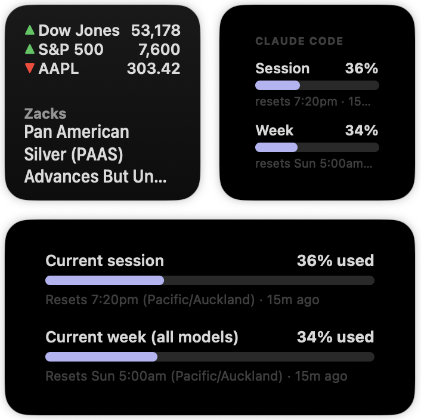

# mac-usage-widget

macOS Notification Center widgets for service usage. The first widget shows
Claude Code subscription limits for the 5-hour session and 7-day windows.

## Requirements

macOS 14+, Xcode, `jq`, and `xcodegen`:

    brew install xcodegen

## Build and install

    ./scripts/build-and-install.sh

This installs `MacUsageWidget.app` in `/Applications` and launches it once so
the widget registers. Add the small or medium widget from Notification Center
→ Edit Widgets.

## Feed it data

    ./scripts/install-statusline.sh    # records usage while Claude Code runs
    ./scripts/install-poller.sh        # refreshes every 10 min while idle

The statusline installer preserves an existing statusline command and backs up
each `settings.json`. Undo it with:

    ./scripts/uninstall-statusline.sh

The data file is in the widget extension container:

    ~/Library/Containers/com.mirabilia.MacUsageWidget.UsageWidget/Data/Library/Application Support/MacUsageWidget/claude-code.json

The host app is intentionally unsandboxed so it can show whether this file is
available and current. The widget extension remains sandboxed.

## Tests

    (cd Core && swift test)     # all logic
    ./tests/test-writer.sh      # statusline writer and wrapper
    ./tests/test-poller.sh      # poller mapping

## Adding another source

Sources are panes inside one widget and share `UsageCore`: add a writer that
produces the same JSON contract under a new filename, add a pane view, and add
a switcher (`Button` + `AppIntent`, or rotating timeline entries). Keep the
widget kind string as `"UsageWidget"`; changing it orphans already-placed
widgets.
